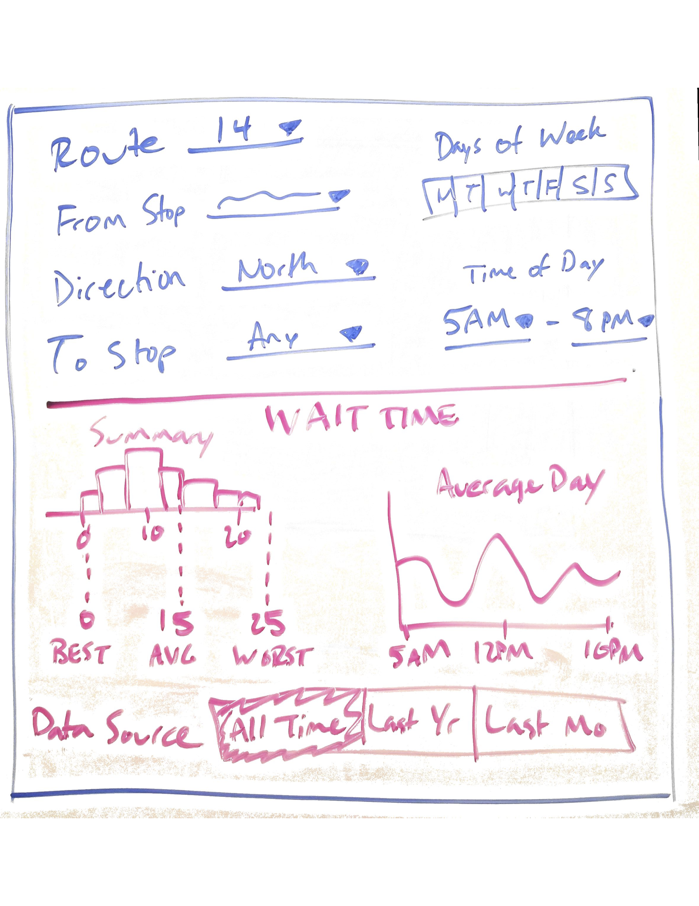

# [OpenTransit](http://opentransit.city/) x [Open Data Day 2019](https://www.eventbrite.com/e/code-for-san-francisco-open-data-day-2019-tickets-56291530483)

Welcome to Open Data Day 2019!

Today, we're going to give you raw and processed GPS data for Muni buses
in San Francisco.

Your challenge is to clean, analyze, and/or visualize that data and build
something useful for San Franciscans. And, along the way, we hope you'll
learn how the whole open data analysis process works

# The challenges

We have three challenges for you today, each one very similar to a challenge
our team of coders and analysts has had to tackle. For each, we'll give you
data to work with and sample code. Your job is to build something great
with the data.

At the end of the day, we encourage you to make a pull request with your code,
and we'll incorporate the best code into the [data visualization prototype we're building](https://github.com/trynmaps/metrics-mvp).

## Challenge 1: Processing

We've gathered raw data on where every Muni bus has been every 15 seconds for
over a year. This piles up to over 230 MB of data a day.

Our first challenge was to convert this raw data into "arrival
times" -- so we could know when each bus reached each stop. Only then
could we start making interesting analyses and visualizations.

In this challenge, we'll give you a subset of our raw GPS data for a day
(trust us, analyzing all 230 MB of data takes way too long).
We'll also give you an example of the algorithm we use to calculate arrival times,
which we call the "eclipses" algotithm.

Your job is to make a better version of our arrival-time algorithm than the
"eclipses" algorithm. We'll give you the raw data and our example code --
can you get better outputs?

To get started with this challenge, check out the [1-processing](1-processing) folder.

## Challenge 2: Analysis

Once we had computed the arrival times, we needed to start analyzing the
processed data to extract useful transit metrics.

In this challenge, we'll give you a sample of our pre-processed data, which shows
when each bus reached each stop (e.g. bus #123 on route #1 reached stop #456
at 3:45pm). The metrics we've calculated so far include average waiting time
at a given stop and average transit time between two stops.

Can you think up some more interesting metrics or find some interesting
patterns? Some questions you could try answering:

- At which time of the day are buses the latest?
- At which time of the day are buses the slowest?
- On which days of the week are buses faster or slower than average?
- When does there seem to be the most traffic?
- Did the bus ever take a detour or miss a stop?

To get started with this challenge, check out the [2-analysis](2-analysis) folder.

## Challenge 3: Visualization

The final challenge is to turn our data and metrics
and present them in a useful, informative way.

We'll give you the raw GPS data and our processed arrival time
data, as well as a sample Jupyter notebook with some demo
visualizations.

What's the coolest and most interesting visualization you can
make? For an added challenge, try adding in geographic, traffic,
or economic data, which you might be able to get from other
open data portals.

To get started with this challenge, check out the [3-visualization](3-visualization) folder.

## Which challenge should I do?

If you love data science and algorithms, or want to dig deep into iPython 
notebooks, try Challenge 1.

If you enjoy statistical analysis and want to draw in geographic, economic,
or other datasets, try Challenge 2.

If you like graphs, want to make user-facing products, or want to try your hand at React
and D3, try Challenge 3.

# Getting ready to code

Fork this repository and choose the folder that corresponds to the challenge you want
to tackle. Each folder will contain the full 230 MB dataset, a light version that
includes a subset of the data, and a Jupyter notebook with our reference implementation
of the code.

We suggest installing [Anaconda](https://www.anaconda.com/distribution/) to get iPython
on your machine.

Then clone this repository and `cd` into it. Then run `jupyter notebook` in your terminal
to browse, run, and play with our interactive Python notebooks.

# Submission

If you want our project to use your code, just make a pull request of your fork! We'll
review it and incorporate the best submissions into our
[prototype](https://github.com/trynmaps/metrics-mvp).

# More about OpenTransit

[Check out a (very early-stage) demo of our app!](https://opentransit.herokuapp.com/metrics)
[And check out the GitHub repo.](https://github.com/trynmaps/metrics-mvp)

Here's a (very rough) mockup of our main app:

